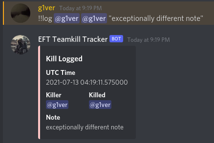
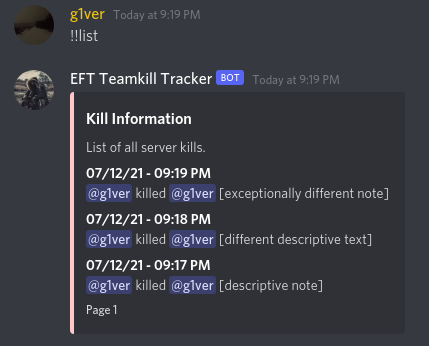
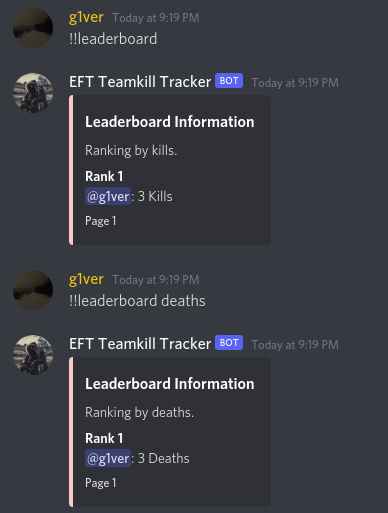
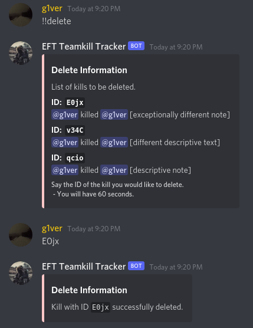
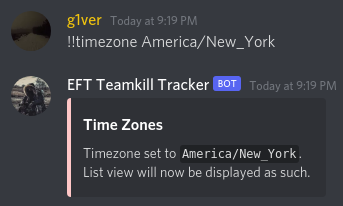

## NOTE: I am currently rewriting the whole bot to comply with Discord's new bot standards (using slash commands instead of chat commmands
Read here: https://support-dev.discord.com/hc/en-us/articles/4404772028055-Message-Content-Access-Deprecation-for-Verified-Bots

# EFT-Teamkill-Tracker
Discord Bot for tracking teamkills in Escape from Tarkov

# Invite Link
https://discord.com/oauth2/authorize?client_id=864333416191229973&scope=bot&permissions=248896

## Source Code soon...
- Backend API using DjangoRestFramework
- Discord Bot using Discord.py

Report bugs or request features here: https://github.com/g1ver/EFT-Teamkill-Tracker/issues

## Planned features:
- Web client
- Public API
- Porting to multiple languages
  - Looking for translators!

# Commands 
- !!log **@Killer** **@Killed** _"note"_
  - Log a kill within the database.
  - Note must be in quotes
  - Note must be less than 300 characters.
- !!list
  - Get a list of kills from the database.
- !!leaderboard (**_kills_** / **_deaths_**)
  - See a leaderboard of either kills or deaths, sorted by descending order.
- !!delete
  - Remove a logged kill from the database.
- !!timezone (**help** / **list** / **_"timezone"_**)
  - Change the timezone associated with !!list.
- !!help
  - See a list of commands.
## Screenshots

